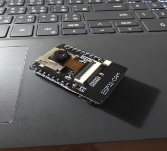
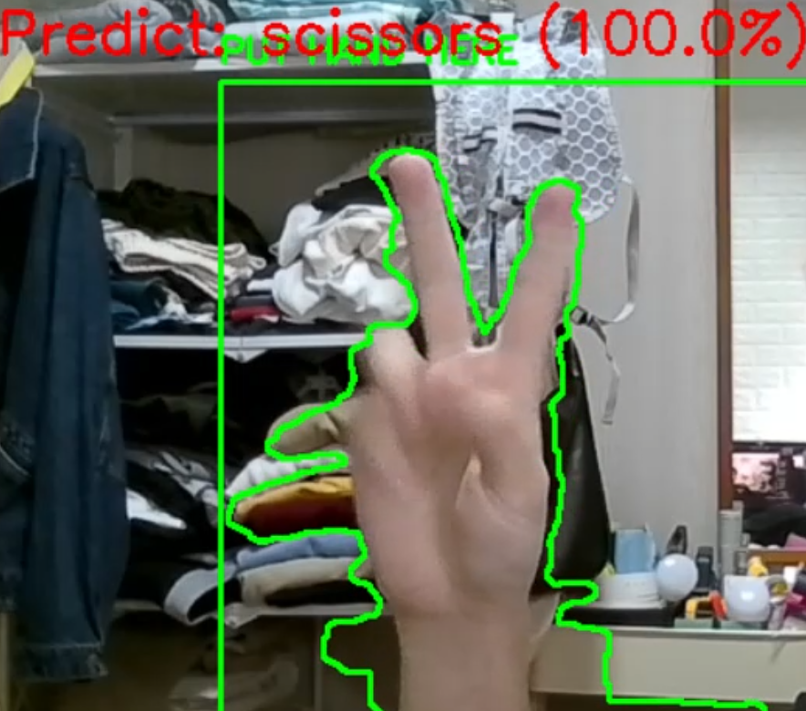
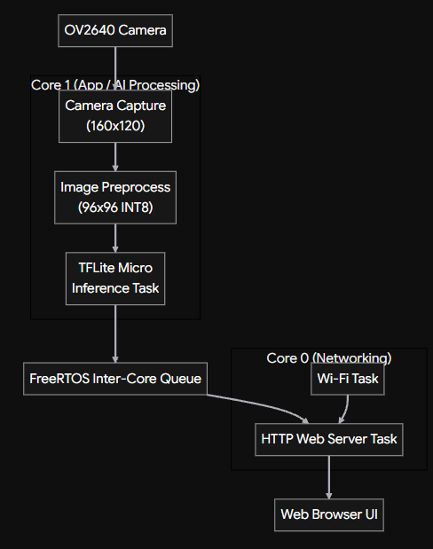
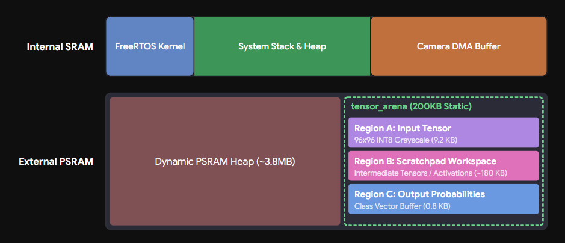
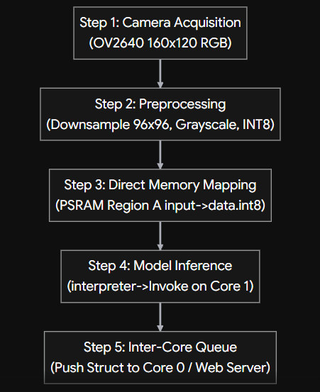

# ESP32-CAM: Edge AI Gesture Recognition System

An end-to-end TinyML gesture recognition system deployed on the ESP32-CAM microcontroller. This project covers the full engineering lifecycle: from training custom neural network models from scratch in Google Colab with Post-Training Quantization (INT8), to asymmetric FreeRTOS dual-core task scheduling, zero-dynamic-allocation memory management (with memory alignment optimization) on ESP32, and real-time streaming alongside web server inference output.

---

## 🎬 Live Demo & Output Showcase

### 1. Project Demonstration Video

> 📺 **[Watch Full Demonstration Video on YouTube](https://youtu.be/n_18eMHc4QQ)**

### 2. Real-Time Gesture Recognition Output (Scissors Recognition)

---

## 🌟 Key Technical Features

* **Full-Pipeline Model Development:** Custom dataset collection and neural network model architecture designed from scratch, followed by preprocessing, Post-Training Quantization (INT8), and export to a raw C++ byte array (`.h` header file).
* **Advanced Memory Management (PSRAM & Memory Alignment):** Statically allocates a 200 KB `tensor_arena` inside PSRAM using strict **Memory Alignment** techniques, completely eliminating runtime dynamic allocations (`malloc`) to guarantee zero long-term memory fragmentation.
* **FreeRTOS Dual-Core CPU Task Scheduling:** Implements multi-threaded task isolation—Core 0 handles Wi-Fi connection and HTTP Web Server requests, while Core 1 dedicates computing resources exclusively to high-load TFLite Micro AI inference, maximizing overall system throughput and stability.
* **Hardware-Friendly Image Preprocessing:** Performs in-place bilinear downsampling ($160 \times 120 \rightarrow 96 \times 96$), fixed-point luminance-weighted grayscale conversion, and INT8 range normalization directly within memory.
* **Embedded Edge AI Deployment:** Optimizes the TensorFlow Lite for Microcontrollers inference engine for tight microcontroller resource limits, achieving low-latency and low-power on-device AI execution.

---

## 🧠 System Architecture & Memory Layout

### 1. FreeRTOS Dual-Core Task Pipeline
Core 0 processes asynchronous Wi-Fi connectivity and HTTP client requests, while Core 1 continuously executes camera frame acquisition, image preprocessing, and neural network inference.

### 2. PSRAM Tensor Arena Partitioning & Alignment
The statically pre-allocated and aligned 200 KB PSRAM space is partitioned into three contiguous regions: Region A (Input Tensor Buffer), Region B (Intermediate Scratchpad Buffer), and Region C (Output Class Probabilities Buffer).

---

## 🔄 System Execution Flow

The system execution pipeline consists of 5 highly efficient processing steps:

1. **Frame Acquisition:** OV2640 camera module captures raw $160 \times 120$ RGB frame buffer.
2. **Preprocessing:** Performs downsampling to $96 \times 96$, luminance-weighted grayscale conversion (`(77*R + 150*G + 29*B) >> 8`), and INT8 normalization (`gray - 128`).
3. **Direct Memory Mapping:** Preprocessed pixels are directly written to the aligned input buffer `input->data.int8`.
4. **Model Inference Execution:** Calls `interpreter->Invoke()` to execute quantized matrix multiply-accumulate operations.
5. **Thread-Safe Result Output:** Classification results are pushed via a thread-safe FreeRTOS Queue to the Web UI and Serial Monitor in real time.

---

## 🛠️ Hardware Setup

* **Microcontroller:** ESP32-CAM Development Board (equipped with OV2640 camera module).
* **Power Supply:** External 5V / 2A dedicated power supply recommended (ensures stable Wi-Fi transmission and camera sensor operation).

---

## 🚀 How to Reproduce & Run

### Step 1: Model Training & Export
1. Run [`gesture_train.ipynb`](gesture_train.ipynb) in Google Colab or your local Jupyter environment using the training images under [`dataset/`](dataset/).
2. Executing the notebook will train the Keras model (`rps.h5`), apply INT8 Post-Training Quantization (`model_quant_esp32.tflite`), and export the final compiled model array header file [`model_data.h`](model_data.h).

### Step 2: Firmware Deployment
1. Open the main firmware sketch [`ESP32_RPS_Inference.ino`](ESP32_RPS_Inference.ino) in Arduino IDE.
2. Ensure `model_data.h` is placed in the same directory as the main sketch.
3. Update your Wi-Fi credentials directly inside the code, compile, and upload to your ESP32-CAM board.

---

## 📝 License

This project is licensed under the **MIT** License.
